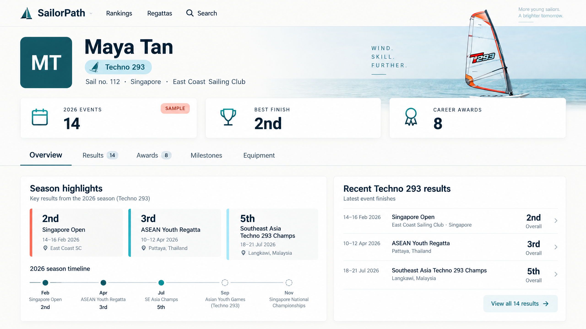
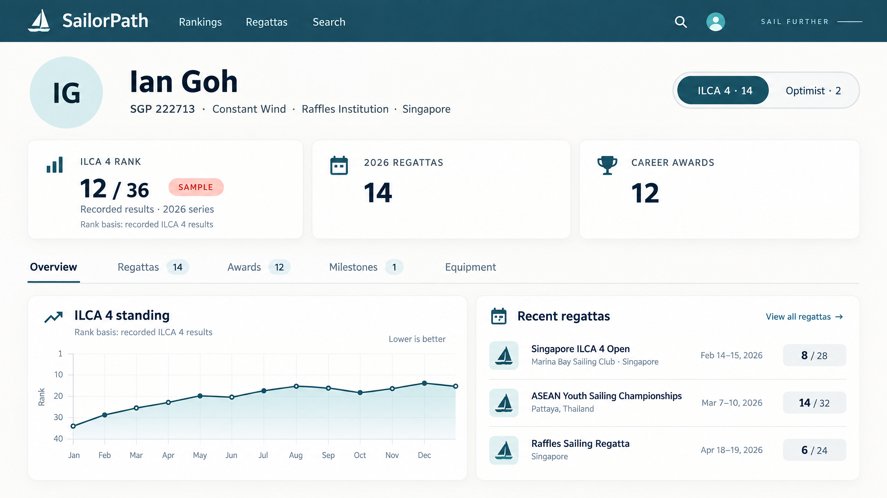

# Sailor profile UX proposal — board sailing and dinghy profiles

**Scope:** A design proposal only; no application UI was changed. The mockups are concepts, and all displayed names, rankings, finishes, counts, and awards are illustrative—not live sailor data.

**Assumption:** “Board sailors” means Techno 293 and similar board-sailing disciplines (for example, Wingfoil). The board concept below is specifically Techno 293; the same shell can use a different class-specific summary for other board disciplines.

## Direction in one sentence

Keep one recognizable SailorPath profile shell, but make the profile’s main content follow the sailor’s discipline: a board-sailing profile should lead with board-class results and event performance; an Optimist/ILCA profile should lead with its class selector and class-appropriate standing. **Remove the generic Status card from every profile.**

## What the current concept gets wrong for a board sailor

The earlier concept used an ILCA 4 selector, ILCA ranking, and Optimist as its alternate class. That makes sense only for a sailor who has Optimist/ILCA results. A Techno 293 sailor should not be shown through a dinghy-first template: the class identity, summary metrics, results, and any standing should all refer to the board class they actually race.

The earlier “Status” card is also generic. A value such as “Active national competitor” usually repeats what a visitor can already infer from results and does not help distinguish one athlete’s profile from another. The proposal removes the whole card, rather than replacing it with a differently named status tile.

## A shared profile shell, with class-aware content

Both designs keep the useful common elements:

1. **Identity:** Sailor name, sail number, club/school, and country.

1. **One class context:** A class badge for a single-class profile, or a single selector when more than one class has relevant profile data.

1. **Performance summary:** Only metrics that make sense for the selected class and available data.

1. **Section navigation:** Overview, Results/Regattas, Awards, Milestones, and Equipment, with counts where useful.

1. **Recent activity:** A short set of recent, class-matched results.

The class selector and section navigation answer different questions and should remain visually distinct. Changing the class should change the rank/standing, stats, and results together; changing a section should only change what part of that class profile is being explored.

## Variant A — Techno 293 and other board sailors

### Identity and class context

Lead with the sailor’s name and a clear **Techno 293** label. Include the sail number and the sailor’s club or country when available. Do not show Optimist or ILCA controls on a Techno-only profile. If a sailor has meaningful records in multiple board disciplines, show one selector containing only those disciplines and their result counts.

A board-specific distinction or division may be useful when the underlying event records support it. Show it as class context—not as a guessed attribute. Avoid adding age, gender, or fleet labels unless they are actually part of the recorded competition result.

### The three summary slots

Use the space formerly occupied by status for information about the sailor’s board-sailing activity. Good candidates are:

- **Season events** — number of Techno 293 events represented in the selected season.

- **Best finish** — an actual result-derived finish, when one exists.

- **Career awards** — only when awards are recorded.

If a real published Techno 293 or event-series standing exists, that standing may take the lead. Label it precisely (for example, **2026 Techno 293 series standing**) and identify the applicable series or division. If no such standing exists, do **not** manufacture a “national rank” just to fill a card; lead with results volume and best finish instead.

### Results and sections

The overview should show recent Techno 293 events and finishes, with event name and date. Use a short “View all” route to the full Results section. A board setup/equipment section should appear only when there is meaningful board or sail information stored for that sailor; otherwise omit it rather than showing an empty equipment panel.

### Mockup

## Variant B — Optimist and ILCA sailors

### Identity and class context

Keep the same identity-first header. If the sailor has both Optimist and ILCA results, use a single, count-aware class selector—for example, **ILCA 4 · 14** and **Optimist · 2**—and select the most relevant class by default. If the profile contains only one class, show its badge and omit the unused selector option.

The selected class must remain consistent across the rank/standing card, statistics, and result list. Do not show an Optimist fleet label or ranking while the rest of the profile is in ILCA mode, or vice versa.

### Rank and standings

For Optimist, use the correct Optimist series/fleet context. For ILCA, use ILCA’s applicable standing. Whenever a profile rank is shown, explain its basis and cycle: an official national-list standing should be distinguishable from a profile calculation based on recorded results. If no qualifying rank is available, show a helpful no-rank explanation instead of a bare dash.

The other summary slots can show season regattas and career awards, provided those counts exist. The generic Status card is absent.

### Mockup

## Removing Status without losing useful actions

The proposal removes the athlete **Status** summary everywhere; it does not require hiding account-management actions. If profile ownership or claiming needs to be communicated, keep that as a small, separate account action or badge—not as a performance metric beside rank, results, or awards. The profile should not use “Active national competitor” as a universal status when it is redundant with the sailor’s actual results.

## Mobile behavior

Use the same class-specific content and omit the Status tile on mobile too. Stack the content in this order:

1. Sailor name and identifying details.

1. Class badge or the one relevant class selector.

1. The selected discipline’s best available standing/result summary.

1. Events and awards as compact secondary metrics.

1. A scrollable section strip with readable counts.

1. A short recent-results preview.

Do not squeeze three desktop summary cards into a narrow row. Board results should remain board results; Optimist/ILCA ranks should retain their class and basis labels. Hide sections without content unless there is a deliberate empty state worth showing.

## The two visual concepts

- [Techno 293 / board-sailing profile concept](sailor-profile-boards-concept.png) shows a board-first profile with season events, best finish, awards, and Techno 293 results—no Optimist/ILCA controls and no Status card.

- [Optimist / ILCA profile concept](sailor-profile-opti-ilca-concept.png) shows one integrated class selector, class-specific rank context, event counts, and awards—again, no Status card.

Both images are visual proposals, not screenshots of working software. Numbers and performance data are sample values.

## Recommended implementation order if approved

1. Remove the generic Status tile from every sailor profile.

1. Select a profile content mode from the sailor’s actual class/result history; do not force every sailor into Optimist/ILCA.

1. Define the board-sailing summary rules: show a real board-series standing where available; otherwise show event count and best finish.

1. Keep a single class selector only for sailors with multiple relevant classes, and ensure all class-specific content changes together.

1. Refine section visibility, counts, empty states, and the mobile reading order.

## Acceptance checks

- A Techno 293 sailor sees Techno 293 details by default and no Optimist/ILCA-only controls unless those classes are also relevant to their profile.

- A board sailor is not assigned a made-up national rank when the data only supports event results.

- Optimist and ILCA sailors see the correct class-specific standing and matching results.

- No generic athlete Status summary card is shown on any profile.

- The selected class is visually obvious and remains consistent across all profile content.

- Empty class/section options are hidden or explained; no blank placeholder cards remain.

- On mobile, class context and rank/finish basis remain readable without horizontal layout compression.
